# 👋 Hi, I’m Greg!

Welcome to my GitHub profile!  
I’m passionate about programming, automation, artificial intelligence, and open source. Here you’ll find my projects, ideas, and contributions.

## 🚀 About Me

- 💻 Enthusiastic developer
- 🌱 Currently learning Rust
- 🤖 Interested in AI, with a focus on local deployment solutions
- 🤝 Open to collaboration and open-source contributions
- 📫 Contact: greg.at.gregorymariani.com or via GitHub

## 🛠️ Technologies & Tools

**Frontend:**  
- React (Beginner)  
- HTMX (JavaScript)  
- Alpine (JavaScript)  
- Tailwind (CSS)  

**Backend:**  
- Python (Django, Flask)  

**Python Ecosystem:**  
- NumPy, Pandas  
- LangChain, Pydantic  
- FastMCP  
- Ollama, LocalAI  

**Network:**  
- Fail2Ban  
- OpenVPN  
- Nginx, Reverse Proxy  

**Testing:**  
- Pytest, Unittest, Jest  

**DevOps:**  
- GitHub Actions, CircleCI  
- Sentry  
- Docker  
- ElasticSearch  

**APIs:**  
- Django DRF (REST), FlaskAPI  

**Databases:**  
- MySQL, PostgreSQL, PG vector, Chroma, LanceDB  

**System & Scripting:**  
- Linux (Debian Trixie, Ubuntu LTS), Shell scripting  
- Multi-arch deployment (armV7/8, arm64, i86)  

## 📈 GitHub Stats

## ✨ Featured Projects

- [gmaOCR-rs](https://github.com/gmaOCR/gmaOCR-rs) — Rust library for OCR, fully rewritten and optimized
- [gmaPDF-rs](https://github.com/gmaOCR/gmaPDF-rs) — Rust library for fast PDF document manipulation
- Other private projects focused on AI and automation

## 🎉 Contributions

- Contributor to [Django](https://github.com/django/django)
- Contributor to [django-oscar-api](https://github.com/django-oscar/django-oscar-api)
- Contributor to [LocalAI](https://github.com/mudler/LocalAI)

## 🎯 Goals

- Keep learning and sharing on GitHub
- Contribute to open-source projects
- Collaborate with other developers
- Increase my skill with IA fluent workflow

---

Thanks for visiting my profile!  
Feel free to contact me or contribute to my projects 🚀
